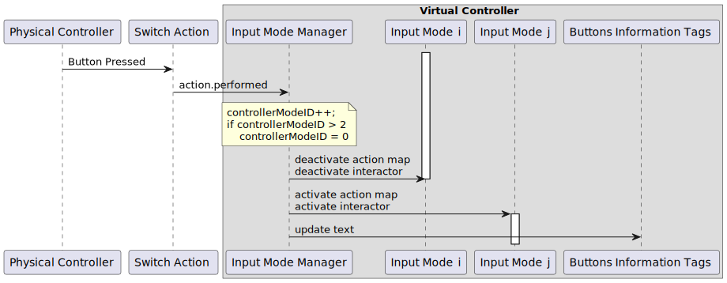

The User Interface (UI) of the project is in a state of "means to an end". It has been tweaked enough to work and it is not very well organized.

## Interactions
Unity provides a solution to support Extended Reality development called [XR Interaction Toolkit](https://docs.unity3d.com/Packages/com.unity.xr.interaction.toolkit@1.0/manual/index.html). From this package, we used the `XRRig`, `InteractionManager`, `XRController (Action-Based)`, `XRRayInteractor`, `XRGrabInteractable`, and a few others to enable interaction and navigation in _Dive Scenes_ via the XR controllers.

In _ECellDive_, every interaction with objects or UI menus is performed remotely thanks to [rays](../UserManual/Controls/ray_based_interaction_controls.md) that stems from the base of the controllers and extend for 30 units of distance in the virtual environment. The parameters of the rays are controlled by an `XRRayInteractor` component attached to the gameobject (GO) representing the ray. In the `Player` prefab (`Assets/Resources/Prefabs/Player`) search for the GOs named `G Left Ray`, `RG Left Ray`, or `RI Left Ray` to have examples. A ray interactor works in pair with an interactable in the scenes (e.g. `XRGrabInteractable`) via an interaction manager (i.e., the `XRInteractionManager` in the main scene). In _ECellDive_ every module have an `XRGrabInteractable` and the 2D UI have a `TrackedDeviceGraphicRaycaster`. The `XRRayInteractor` and `XRGrabInteractable` offer a large range of parameters but we mostly don't use them. We only use the pair of components to use [the interaction detection system implemented in the interaction manager](https://docs.unity3d.com/Packages/com.unity.xr.interaction.toolkit@1.0/manual/index.html#update-loop) and to bind to events related to this detection such as `First/Last Hover` (e.g. the `XRGrabInteractable` of `CyJsonModule` prefab at `Assets/Resources/Prefabs/Modules/CyJsonModules`). Then, we implemented our own subsystems such as a customized object movements with the [GrabManager](xref:ECellDive.PlayerComponents.GrabManager) (in every modules), or a customized player teleportation and continuous movements in [MovementManager](xref:ECellDive.PlayerComponents.MovementManager) (in `MVT Left Container` and `MVT Right Container` in the `Player` prefab).

We separated the inputs of _ECellDive_ in three sets of action maps for the movements (teleportation & continuous), the ray-based interaction with UI and modules (grab & move, press button), the ray-based and volumetric interactions with modules to make custom groups. Users can switch cycle on them thanks to the component [InputModeManager](xref:ECellDive.Input.InputModeManager) (in `Controllers` of the `Player` prefab). The component exposes access to two fields [refLeftControlSwitch](xref:ECellDive.Input.InputModeManager.refLeftControlSwitch) and [refRightControlSwitch](xref:ECellDive.Input.InputModeManager.refRightControlSwitch) to specify which action will trigger the input mode cycle on the respective controller. In turn, the action are listening to buttons of the controllers. Hence, when the user press the corresponding button, the action is performed which leads to execution of [LeftControllerModeSwitch](xref:ECellDive.Input.InputModeManager.LeftControllerModeSwitch(InputAction.CallbackContext)) or [RightControllerModeSwitch](xref:ECellDive.Input.InputModeManager.RightControllerModeSwitch(InputAction.CallbackContext)). Those two methods respectively increment the [leftControllerModeID](xref:ECellDive.Input.InputModeManager.leftControllerModeID) and [rightControllerModeID](xref:ECellDive.Input.InputModeManager.rightControllerModeID): the ray-based controls are associated with value `0`, the movement controls with value `1`, and the group controls with value `2`. From `2`, the value cycles to `0`. [leftControllerModeID](xref:ECellDive.Input.InputModeManager.leftControllerModeID) and [rightControllerModeID](xref:ECellDive.Input.InputModeManager.rightControllerModeID) are network variables which changes trigger the network event `OnValueChanged` to which the methods [ApplyLeftControllerActionMapSwitch](xref:ECellDive.Input.InputModeManager.ApplyLeftControllerActionMapSwitch(System.Int32,System.Int32)), [ApplyLeftControllerInteractorsSwitch](xref:ECellDive.Input.InputModeManager.ApplyLeftControllerInteractorsSwitch(System.Int32,System.Int32)), [ApplyRightControllerActionMapSwitch](xref:ECellDive.Input.InputModeManager.ApplyRightControllerActionMapSwitch(System.Int32,System.Int32)) and [ApplyRightControllerInteractorsSwitch](xref:ECellDive.Input.InputModeManager.ApplyRightControllerInteractorsSwitch(System.Int32,System.Int32)) have respectively subscribed. Finally, in those methods, the action maps and interactors the previous [leftControllerModeID](xref:ECellDive.Input.InputModeManager.leftControllerModeID) or [leftControllerModeID](xref:ECellDive.Input.InputModeManager.leftControllerModeID) are deactivated while the ones of the new value are activated. Finally, the information tags of the buttons are updated to match the new input mode.

## 2D UI menus
All 2D UI panel menus are hand-made. Until this point during development, it has been more cost-efficient to duplicate already existing 2D UI items than to spend time making a procedural script that could generate some base menus. As a consequence there is quite a number of 2D UI items in the projects that resemble each other and have only been slightly modified.

### In the UI folder
The UI menus are at the path `Assets/Resources/UI`.

- The `Custom Group Maker` is the prefab to name validate or cancel the creation of a custom group made by the users in ECellDive.
- The `External Object Container` is the prefab holding the [GUIManager](xref:ECellDive.UI.GUIManager) that is mandatory for our the Main scene.
- `Info Display` is an example of a 2D UI panel with a `LineRenderer` that can make a connection with another object to make them seem attached and related. That's what is used on the demonstration gameobject (GO) `BaseModule` found at `Assets/Resources/Modules`
- `Info Tag` is a specialization of `Info Display` to inform about the actions bound to the buttons of the XR controllers. It has the component [InfoTagManager](xref:ECellDive.UI.InfoTagManager) to control its content based on the current input mode of the controller.
- `Picker 2.0 VR` is color picker downloaded from the Unity Asset Store adapted to work in an XR scene.
- `Picker 2.0 VR Holder` is simply a `Picker 2.0 VR` encapsulated into a GO that can react to user's interaction to move it ([GrabManager](xred:ECellDive.PlayerComponents.GrabManager)) and automatically rotate to be readable from the point of view of the user ([FaceCamera](xref:ECellDive.Utility.FaceCamera)). This one should probably be deleted and replaced with a compound scene GO made from the `Picker 2.0 VR` and `UI Graphics Holder`.
- `Position Handle` [OBSOLETE] Use the one in `./Elements` folder.
- `Surge Info Tag` is a specialized info tag with a _surge and shrink_ animation. It is used on the left and right controllers to momentarily inform the users about the input mode they are switching to. 
- `UI Graphics Holder` is a container prefab in which to put (as child) 2D UI panels that users can move and should automatically face the user to be readable.

### In the UI/Elements folder
In this folder are some smaller 2D UI elements that are used to make bigger 2D UI menus.

- `Button Scroll List` is an vertical UI with a scroll bar in which `Menu Button` can be instantiated. It uses [OptimizedVertScrollList](xref:ECellDive.UI.OptimizedVertScrollList) to be able to display a lot of elements while limiting performance hit (**but needs further improvements**).
- `Close Button` is a small square cross button that can be use to suggest a way to close 2D UI menus or destroy modules.
- `Drop Down Field` is a button with a name and an arrow sign that switches orientation on button click to suggest that some content can be opened/closed. 
- `Drop Down Scroll List` is an vertical UI with a scroll bar in which `Drop Down Field` can be instantiated. It uses [OptimizedVertScrollList](xref:ECellDive.UI.OptimizedVertScrollList) to be able to display a lot of elements while limiting performance hit (**but needs further improvements**).
- `Group Field` is specialized to display groups in a list. It is a composition of a `Close Button` (to destroy the group), a toggle (to show/hide the group), a color button (triggers opening the `Picker 2.0 VR Holder` to chose the color of the group)
- `Groups Scroll List` is an vertical UI with a scroll bar in which `Group Field` can be instantiated. It uses [OptimizedVertScrollList](xref:ECellDive.UI.OptimizedVertScrollList) to be able to display a lot of elements while limiting performance hit (**but needs further improvements**).
- `Labelled Button` is the composition of a text mesh on the left side with a button on the right. The text mesh introduces the function of the button. It is used to introduced the selection of Kosmogora server in the Tag menus of HTTP Modules.
- `Menu Button` is a basic button. Just added a [UIHover](xref:ECellDive.UI.UIHover)
- `Named Input Field` & `Named Input Field 2` are a composition of a text mesh on the left and an input field on the right. The main difference is the appearance: they have different default values of `Pixel Per Unit Multiplier` in the `Image` components.
- `Position Handle` is the prefab to the white horizontal bar handle that is present on almost every other 2D UI to allow user to move the 2D UI they are part of.
- `Semantic Group Field` is a specialized `Group Field` to represent every groups that were grouped using a specific semantic.
- `Semantics Groups Scroll List` is an vertical UI with a scroll bar in which `Semantic Group Field` can be instantiated. It uses [OptimizedVertScrollList](xref:ECellDive.UI.OptimizedVertScrollList) to be able to display a lot of elements while limiting performance hit (**but needs further improvements**).
- `Slider Value Color Combo` is a composition of a name, a slider, a field to display the value, `+` and `-` button to slowly increment or decrement the value, and a color button to assign a color to this value. Two `Slider Value Color Combo` are used to linearly map a range of values between colors.
- `Slider Value Control` is a composition of a name, a slider, a field to display the value, `+` and `-` button to slowly increment or decrement the value. It is used to control numerical values.
- `Toggle Field` is a composition of a toggle on the left and a name on the right.
- `Toggle Scroll List` is an vertical UI with a scroll bar in which `Toggle Field` can be instantiated. It uses [OptimizedVertScrollList](xref:ECellDive.UI.OptimizedVertScrollList) to be able to display a lot of elements while limiting performance hit (**but needs further improvements**).

All scroll lists could certainly be refactored into one.

### In the UI/Menu Elements
In this folder are 2D UI composed by elements found in `UI/Elements`.

- `Buttons Menu` is a composition of `Button Scroll List` with a `Position Handle`, a name, a `Close Button` and a pin/unpin pair of buttons.
- `Drop Down Menu` is a composition of `Drop Down Scroll List` with a `Position Handle`, a name, a `Close Button` and a pin/unpin pair of buttons. Clicking a `Drop Down Field` in the scroll list will spawn a `Buttons Menu` with the content associated to the drop down.
- `Groups Menu` is a composition of `Groups Scroll List` with a `Position Handle`, a name, a `Close Button` and a pin/unpin pair of buttons.
- `Log Menu` is the menu where users can consult log messages. It is a composition of a `Button Scroll List`, a wide message space, toggles to control the visibility of the messages, a `Close Button` and a pin/unpin pair of buttons. [LogManager](xref:ECellDive.UI.LogManager) is attached to the root GO.
- `Main Menu` is a a custom display of buttons to open other menus. [MainMenuManager](xref:ECellDive.UI.MainMenuManager) is attached to the root GO.
- `Modules Menu` is a a custom display of buttons to spawn modules. [ModulesMenuManager](xref:ECellDive.UI.ModulesMenuManager) is attached to the root GO.
- `Semantic Groups Menu` is a composition of `Semantic Groups Scroll List` with a `Position Handle`, a name, a `Close Button` and a pin/unpin pair of buttons. [GroupsMenu](xref:ECellDive.UI.GroupsMenu) is attached to the root GO.
- `Settings Menu` [OBSOLETE]
- `Short Demo Menu` i is a a custom display of button to switch between aspects of the demo, to reset the visuals, or to quit the demo.
- `Toggles Menu` is a composition of `Toggle Scroll List` with a `Position Handle`, a name, a `Close Button` and a pin/unpin pair of buttons.
- `Tutorial Panel` is a custom display of buttons and text to give the tutorial instructions.
- `Tutorials Menu` is a custom display of buttons to open the tutorials and the demo. The buttons triggers an _Unity Scene_ change so their callbacks must be set in the main scene to use the [AssetScenesManager](xref:ECellDive.SceneManagement.AssetScenesManager).

Most of the menus are encapsulated in a `UI Graphics Holder` in the main scene to manage their translations and automatically face the user to be readable.

### In the UI/Tag Menus
In this folder are 2D UI elements that are attached to modules. So it is a combination of UI elements and the graphic link system to display a line between the menus and the modules they are attached to. They all use the [InfoDisplayManager](xref:ECellDive.UI.InfoDisplayManager).

- `Anchored Dynamic Content` encapsulates a `Button Scroll List` to display a list of options that may be associated to a module. The rest of the UI panel's names indicate to which module they are part of. `FBA Visuals Parameters` uses [FbaParametersManager](xref:ECellDive.UI.FbaParametersManager) and `GroupByAttributsDisplay` uses [GroupByAttributsManager](xref:ECellDive.UI.GroupByAttributsManager).
- `CyJsonModuleParameters` is the tag menu of the `CyJsonModule`. It encapsulates toggles and sliders to globally override some parameters of the CyJson graph encoded in the module it is attached to.
- `FBA Visuals Parameters` is the tag menu of `HttpServerFbaModule`. It encapsulates `Slider Value Color Combo` to control the color interpolation between the lowest and highest fluxes values. It uses [FbaParametersManager](xref:ECellDive.UI.FbaParametersManager) 
- `GroupByAttributesDisplay` encapsulates a `Toggle Scroll List` to display the attributes used to automatically make groups with [GroupByAttributsManager](xref:ECellDive.UI.GroupByAttributsManager). It also contains prefabs to spawn and visualize the content of the groups.
- `HttpModificationFileParameters` is the tag menu of `HttpServerModificationModule`. It encapsulates 2 `Labelled Button` to select the server where to load from (or save to) modification files and to detect the base model on which those modifications apply. It also contains a button to query the modifications. Finally, an input field to chose the name of the modification file to save and a button to request saving it.
- `HttpServerQueryParameters` is the tag menu of `HttpServerInfoQueryModule`. It encapsulates 2 `Labelled Button` to select the server that will process the information query, and another to chose which online database the server should consult. Finally, it contains an input field to chose the ID of the reaction for which we want extra information.
- `Multiplayer Parameters` is the tag menu of `MultiplayerModule`. It is a composition of various input fields and buttons to enter information about the multiplayer server to host or join. [MultiplayerMenuManager](xref:ECellDive.UI.ModulesMenuManager) is attached to the root GO.
- `ServerConnectionParameters` is the tag menu of `HttpServerAPICheckerModule`. It is a composition of 3 input fields to enter the server address and name of the server for which to check the API.
- `ServerSelectionParameters` is the tag menu to select the server that will be used by an HTTP module to perform its tasks. It is used by `HttpServerFbaModule` and `HttpServerImporterModule`.