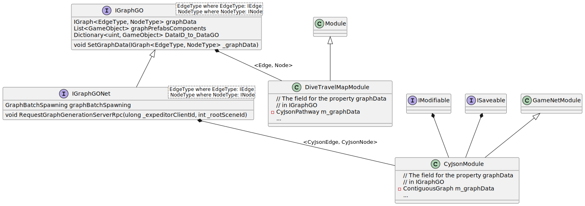

This section is presenting how graphs are encoded in _ECellDive_ and interfaces or classes you may want to inherit from in order to build your own graphs.  
In _ECellDive_, the graph API was used to encode the metabolic pathways for [Cytoscape Json](https://manual.cytoscape.org/en/stable/Cytoscape.js_and_Cytoscape.html) files and the [Dive Travel Map](../../articles/UserManual/dive_map.md).  

## General  
The API to encode graphs is separated in two parts that we call _layers_ in the following sections. The data layer are interfaces limited to data fields describing an edge, node, or a graph. This layer also includes the `struct` or `class` that implement these interfaces.  
Instances of objects from the data layer are then usually class members of objects in the [GameObjects (GOs) Layer](./about_graphs.md#gameobjects-layer). Classes in the GOs layer are `MonoBehaviour` that can be attached as components to GOs in Unity's Editor.  

## Add a New Graph Component
There are two ways to add a new type of edge, node, or graph. One is to only define a new object in the GO Layer that uses the existing data structures (e.g., [Edge](xref:ECellDive.GraphComponents.Edge), [Node](xref:ECellDive.GraphComponents.Node), etc.) in the Data layer. Or, you can define a new object in the data layer which you can then use in a new object in the GO Layer.  
In the following example we define a new version for everything: a new graph data structure with using a new type of edge and a new type of node. Then, this new graph is encapsulated in a new module. 
You can start by copying the example files that follow:

<details>
  <summary>New Edge Data</summary>

```csharp
namespace ECellDive.Utility.Data.Graph
{
	/// <summary>
	/// DOC
	/// </summary>
	[System.Serializable]
	public struct NewEdge : IEdge
	{
        //
        // ADD NEW FIELDS and/or PROPERTIES HERE
        //

		#region - IEdge Fields -
		/// <summary>
		/// The field for <see cref="ID"/>.
		/// </summary>
		[SerializeField] private uint m_ID;

		/// <inheritdoc/>
		public uint ID { get => m_ID; set => m_ID = value; }

		/// <summary>
		/// The field for <see cref="source"/>.
		/// </summary>
		[SerializeField] private uint m_source;

		/// <inheritdoc/>
		public uint source { get => m_source; set => m_source = value; }

		/// <summary>
		/// The field for <see cref="target"/>.
		/// </summary>
		[SerializeField] private uint m_target;

		/// <inheritdoc/>
		public uint target { get => m_target; set => m_target = value; }

		/// <summary>
		/// The field for <see cref="name"/>.
		/// </summary>
		[SerializeField] private string m_name;

		/// <inheritdoc/>
		public string name { get => m_name; set => m_name = value; }
		#endregion

		public NewEdge(uint _ID, string _name, uint _source, uint _target)
		{
			m_ID = _ID;
			m_source = _source;
			m_target = _target;
			m_name = _name;
		}

        //
        // ADD NEW METHODS HERE IF ANY
        // But consider making this a class if you add methods
        //

	}
}
```
</details>

<details>
  <summary>New Node Data</summary>

```csharp
namespace ECellDive.Utility.Data.Graph
{
	/// <summary>
	/// DOC
	/// </summary>
	[System.Serializable]
	public struct NewNode : INode
	{
        //
        // ADD NEW FIELDS and/or PROPERTIES HERE
        //

		#region - INode Fields -
		/// <summary>
		/// The field for the property <see cref="ID"/>.
		/// </summary>
		[SerializeField] private uint m_ID;

		/// <inheritdoc/>
		public uint ID { get => m_ID; set => m_ID = value; }

		/// <summary>
		/// The field for the property <see cref="name"/>.
		/// </summary>
		[SerializeField] private string m_name;

		/// <inheritdoc/>
		public string name { get => m_name; set => m_name = value; }

		/// <summary>
		/// The field for the property <see cref="incommingEdges"/>.
		/// </summary>
		[SerializeField] private List<uint> m_incommingEdges;

		/// <inheritdoc/>
		public List<uint> incommingEdges { get => m_incommingEdges; set => m_incommingEdges = value; }

		/// <summary>
		/// The field for the property <see cref="outgoingEdges"/>.
		/// </summary>
		[SerializeField] private List<uint> m_outgoingEdges;

		/// <inheritdoc/>
		public List<uint> outgoingEdges { get => m_outgoingEdges; set => m_outgoingEdges = value; }
		#endregion

		public NewNode(uint _ID, string _name)
		{
			m_ID = _ID;
			m_name = _name;
			m_incommingEdges = new List<uint>();
			m_outgoingEdges = new List<uint>();
		}

        //
        // ADD NEW METHODS HERE IF ANY
        // But consider making this a class if you add methods
        //
	}
}
```
</details>

<details>
  <summary>New Graph Data</summary>

```csharp
namespace ECellDive.GraphComponents
{
    /// <summary>
	/// DOC
	/// </summary>
    public class NewGraph : IGraph<NewEdge, NewNode>
    {
        //
        // ADD NEW FIELDS and/or PROPERTIES HERE
        //

        #region - IGraph Members -
        /// <summary>
        /// The field of the property <see cref="name"/>.
        /// </summary>
        private string m_name;

        /// <inheritdoc/>
        public string name
        {
            get => m_name;
            set => m_name = value;
        }

        /// <summary>
        /// The field of the property <see cref="nodes"/>.
        /// </summary>
        private NewNode[] m_nodes;

        /// <inheritdoc/>
        public NewNode[] nodes
        {
            get => m_nodes;
            set => m_nodes = value;
        }

        /// <summary>
        /// The field of the property <see cref="edges"/>.
        /// </summary>
        private NewEdge[] m_edges;

        /// <inheritdoc/>
        public NewEdge[] edges
        {
            get => m_edges;
            set => m_edges = value;
        }
        #endregion

        public NewGraph(string _name)
        {
            name = _name;
        }

        //
        // ADD NEW METHODS HERE IF ANY
        // There will probably be methods to populate the arrays of edges and nodes.
        //

    }
}
```
</details>

<details>
  <summary>New Edge GO</summary>

In this example, we make it inherit from [Module](xref:ECellDive.Modules.Module) the gameobject will not be synchronized over the multiplayer network. Consider inheriting from [GameNetModule](xref:ECellDive.Modules.GameNetModule) in case you want synchronization.


```csharp
namespace ECellDive.Modules
{
	/// <summary>
	/// DOC
	/// </summary>
	public class NewEdgeGO : Module, IEdgeGO<NewEdge>
	{
        //
        // ADD NEW FIELDS and/or PROPERTIES HERE
        //

		#region - IEdgeGO<NewEdge> Members -
		/// <summary>
		/// The field for the property <see cref="edgeData"/>.
		/// </summary>
		private NewEdge m_edgeData;

		/// <inheritdoc/>
		public NewEdge edgeData
		{
			get => m_edgeData;
			private set => m_edgeData = value;
		}

		/// <summary>
		/// The field for the property <see cref="informationString"/>.
		/// </summary>
		private string m_informationString;

		/// <inheritdoc/>
		public string informationString
		{
			get => m_informationString;
			private set => m_informationString = value;
		}

		/// <summary>
		/// The field for the property <see cref="defaultStartWidth"/>.
		/// </summary>
		[Header("IEdgeGO<NewEdge> Parameters")]
		[SerializeField] private float m_defaultStartWidth;

		/// <inheritdoc/>
		public float defaultStartWidth
		{
			get => m_defaultStartWidth;
			private set => m_defaultStartWidth = value;
		}

		/// <summary>
		/// The field for the property <see cref="defaultEndWidth"/>.
		/// </summary>
		[SerializeField] private float m_defaultEndWidth;

		/// <inheritdoc/>
		public float defaultEndWidth
		{
			get => m_defaultEndWidth;
			private set => m_defaultEndWidth = value;
		}

		/// <summary>
		/// The field for the property <see cref="refColliderHolder"/>.
		/// </summary>
		[SerializeField] private GameObject m_refColliderHolder;

		/// <inheritdoc/>
		public GameObject refColliderHolder
		{
			get => m_refColliderHolder;
			set => m_refColliderHolder = value;
		}
		#endregion

		//
        // Unity methods Awake, Start, OnEnable, Update, etc... if necessary
        //
        
        //
        // ADD NEW METHODS HERE
        //

		#region - IEdgeGO<NewEdge> Methods -
		/// <inheritdoc/>
		public void ReverseOrientation()
		{
			// This is likely specific to the NewEdge data
		}

		/// <inheritdoc/>
		public void SetCollider(Transform _start, Transform _end)
		{
			// This is likely specific to the NewEdge data
		}

		/// <inheritdoc/>
		public void SetDefaultWidth(float _start, float _end)
		{
            // Here is a possible implementation

			defaultStartWidth = _start;
			defaultEndWidth = _end;
		}

		/// <inheritdoc/>
		public void SetEdgeData(NewEdge _edgeData)
		{
            // Here is a possible implementation

			edgeData = _edgeData;

			informationString = $"ID: {edgeData.ID}\n" +
								$"Name: {edgeData.name}\n" +
								$"Source: {edgeData.source}\n" +
								$"Target: {edgeData.target}";
		}

		/// <inheritdoc/>
		public void SetLineRendererPosition(Transform _start, Transform _end)
		{
			// This is likely specific to the NewEdge data
		}

		/// <inheritdoc/>
		public void SetLineRendererWidth()
		{
            // Here is a possible implementation

			lineRenderers[0].startWidth = defaultStartWidth;
			lineRenderers[0].endWidth = defaultEndWidth;
		}
		#endregion
	}
}
```
</details>

<details>
  <summary>New Node GO</summary>

In this example, we make it inherit from [Module](xref:ECellDive.Modules.Module) the gameobject will not be synchronized over the multiplayer network. Consider inheriting from [GameNetModule](xref:ECellDive.Modules.GameNetModule) in case you want synchronization.


```csharp
namespace ECellDive.Modules
{
	/// <summary>
	/// DOC
	/// </summary>
	public class NewNodeGO : Module, INodeGO<NewNode>
	{
        //
        // ADD NEW FIELDS and/or PROPERTIES HERE
        //

		#region - INodeGO Members -
		/// <summary>
		/// The field for the property <see cref="nodeData"/>.
		/// </summary>
		[Header("NewNode Parameters")]
		[SerializeField] private NewNode m_nodeData;

		/// <inheritdoc/>
		public NewNode nodeData
		{
			get => m_nodeData;
			private set => m_nodeData = value;
		}

		/// <summary>
		/// The field for the property <see cref="informationString"/>.
		/// </summary>
		[SerializeField] private string m_informationString;

		/// <inheritdoc/>
		public string informationString
		{
			get => m_informationString;
			private set => m_informationString = value;
		}
		#endregion

        //
        // Unity methods Awake, Start, OnEnable, Update, etc... if necessary
        //
        
        //
        // ADD NEW METHODS HERE
        //

		#region - INodeGO<NewNode> Methods -
		/// <inheritdoc/>
		public void SetNodeData(NewNode _nodeData)
		{
            // Here is a possible implementation

			nodeData = _nodeData;

			informationString = $"ID: {nodeData.ID}\n" +
								$"Name: {nodeData.name}";
		}
		#endregion
	}
}
```
</details>

<details>
  <summary>New Graph GO</summary>

In this example, we make it inherit from [Module](xref:ECellDive.Modules.Module) the gameobject will not be synchronized over the multiplayer network. Consider inheriting from [GameNetModule](xref:ECellDive.Modules.GameNetModule) in case you want synchronization.


```csharp
namespace ECellDive.Modules
{
	/// <summary>
	/// DOC
	/// </summary>
	public class NewGraphGO : Module,
							    IGraphGO<NewEdge, NewNode>
	{
        //
        // ADD NEW FIELDS and/or PROPERTIES HERE
        //

		#region - IGraphGO Members -
		/// <summary>
		/// The field for the property <see cref="graphData"/>.
		/// </summary>
		private NewGraph m_graphData = new NewGraph("NewGraphDataName");

		/// <inheritdoc/>
		public IGraph<Edge, Node> graphData
		{
			get => m_graphData;
			protected set => m_graphData = (NewGraph)value;
		}

		/// <summary>
		/// The field for the property <see cref="graphPrefabsComponents"/>.
		/// </summary>
		[Header("NewGraphGO Parameters")]
		[Header("IGraphGO Parameters")]
		[SerializeField] List<GameObject> m_graphPrefabsComponents;

		/// <inheritdoc/>
		public List<GameObject> graphPrefabsComponents
		{
			get => m_graphPrefabsComponents;
		}

		/// <summary>
		/// The field for the property <see cref="graphScalingData"/>.
		/// </summary>
		[SerializeField] GraphScalingData m_graphScalingData;

		/// <inheritdoc/>
		public GraphScalingData graphScalingData
		{
			get => m_graphScalingData;
		}

		/// <inheritdoc/>
		public Dictionary<uint, GameObject> DataID_to_DataGO { get ; set ; }
		#endregion

        //
        // Unity methods Awake, Start, OnEnable, Update, etc... if necessary
        //
        
        //
        // ADD NEW METHODS HERE
        //
	}
}
```
</details>

## Data Layer


__Links to the corresponding scripting API__:
- Interfaces 
  - [IEdge](xref:ECellDive.Interfaces.IEdge)
  - [IGraph](xref:ECellDive.Interfaces.IGraph`2)
  - [INode](xref:ECellDive.Interfaces.INode)
- Structs
  - [CyJsonEdge](xref:ECellDive.Utility.Data.Graph.CyJsonEdge)
  - [CyJsonNode](xref:ECellDive.Utility.Data.Graph.CyJsonNode)
  - [Edge](xref:ECellDive.GraphComponents.Edge)
  - [Node](xref:ECellDive.GraphComponents.Node)
- Classes
  - [ContinuousGraph](xref:ECellDive.GraphComponents.ContiguousGraph)
  - [CyJsonPathway](xref:ECellDive.GraphComponents.CyJsonPathway)

## GameObjects Layer
### Edge GameObjects


__Links to the corresponding scripting API__:
- Interfaces 
  - [IBezierCurve](xref:ECellDive.Interfaces.IBezierCurve)
  - [IEdgeGO](xref:ECellDive.Interfaces.IEdgeGO`1)
  - [IGradient](xref:ECellDive.Interfaces.IGradient)
  - [IModulateFlux](xref:ECellDive.Interfaces.IModulateFlux)
- Classes
  - [CyJsonEdgeGO](xref:ECellDive.Modules.CyJsonEdgeGO)
  - [EdgeGO](xref:ECellDive.Modules.EdgeGO)
  - [GameNetModule](xref:ECellDive.Modules.GameNetModule)
  - [Module](xref:ECellDive.Modules.Module)


### Node GameObjects


__Links to the corresponding scripting API__:
- Interfaces 
  - [INodeGO](xref:ECellDive.Interfaces.INodeGO`1)
- Classes
  - [CyJsonNodeGO](xref:ECellDive.Modules.CyJsonNodeGO)
  - [GameNetModule](xref:ECellDive.Modules.GameNetModule)
  - [Module](xref:ECellDive.Modules.Module)
  - [NodeGO](xref:ECellDive.Modules.NodeGO)


### Graph GameObjects


__Links to the corresponding scripting API__:
- Interfaces 
  - [IGraphGO](xref:ECellDive.Interfaces.IGraphGO`2)
  - [IGraphGONet](xref:ECellDive.Interfaces.IGraphGONet`2)
  - [IModifiable](xref:ECellDive.Interfaces.IModifiable)
  - [ISaveable](xref:ECellDive.Interfaces.ISaveable)
- Classes
  - [CyJsonModule](xref:ECellDive.Modules.CyJsonModule)
  - [DiveTravelMapModule](xref:ECellDive.Modules.DiveTravelMapModule)
  - [GameNetModule](xref:ECellDive.Modules.GameNetModule)
  - [Module](xref:ECellDive.Modules.Module)