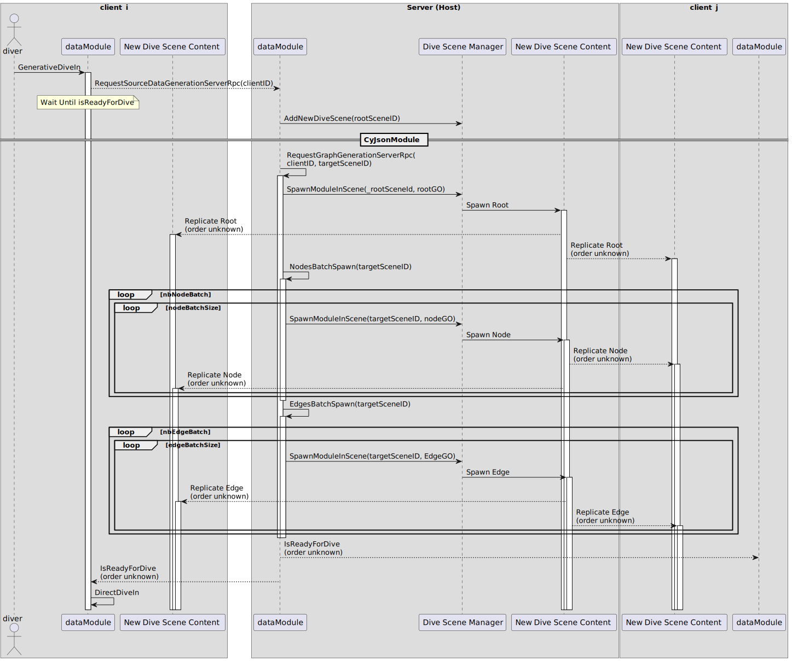

The multiplayer feature of _ECellDive_ is powered by Unity's solution [Netcode for GameObjects](https://docs-multiplayer.unity3d.com/netcode/current/about/index.html) (NetGO). To use NetGO, it is mandatory to include a gameobject with a `NetworkManager` component and a `Transport` component. The former is high-level singleton wrapper to control main settings (e.g., tick rates, log level, network player and objects prefab) and subsystems (e.g., network object spawning, scene management, server start). The latter is the low-level layer to handle network protocols and data packets. It is possible to write custom `Transport` to solve special needs but we are using the default `Unity Transport` for this project. It might be relevant later to implement our own or, at least, adapt a bit Unity's default one to smooth the broadcast of large model files between users in _ECellDive_. You may find those two components attached to the gameobject (GO) named `NetworkManager` in the _Unity Scene_ called `Main` of this project.

# Hosting and Joining
We used the sample project [Boss Room](https://docs-multiplayer.unity3d.com/netcode/current/learn/bossroom/bossroom/) to jump start the host/client architecture of our project. The core of the hosting/connection system in _ECellDive_ is handled by the components [GameNetPortal](xref:ECellDive.Multiplayer.GameNetPortal), [ServerGameNetPortal](xref:ECellDive.Multiplayer.ServerGameNetPortal), and [ClientGameNetPortal](xref:ECellDive.Multiplayer.ClientGameNetPortal) (all are singletons and [ServerGameNetPortal](xref:ECellDive.Multiplayer.ServerGameNetPortal) should not exist at the same time as [ClientGameNetPortal](xref:ECellDive.Multiplayer.ClientGameNetPortal)); while the UI to enter server's settings and whether to host or join pass by the module (and component) [MultiplayerModule](xref:ECellDive.Modules.MultiplayerModule) and its 2D UI menu [MultiplayerMenuManager](xref:ECellDive.UI.MultiplayerMenuManager).

- [MultiplayerModule](xref:ECellDive.Modules.MultiplayerModule)'s role is to give visual feedback that the connection is currently trying to be processed and to indicate whether it is a success (green flashes) or a failure (red flashes).
- [MultiplayerMenuManager](xref:ECellDive.UI.MultiplayerMenuManager)'s role is to retrieve the information given by the user to connect to the server (IPv4, Port, Player Name, and password), and then to ask the [GameNetPortal](xref:ECellDive.Multiplayer.GameNetPortal) to start a host or a client based on the information.
- [GameNetPortal](xref:ECellDive.Multiplayer.GameNetPortal) has three essential methods at this stage which are [StartHost](xref:ECellDive.Multiplayer.GameNetPortal.StartHost), [StartClient](xref:ECellDive.Multiplayer.GameNetPortal.StartClient), and [OnNetworkReady](xref:ECellDive.Multiplayer.GameNetPortal.OnNetworkReady(System.UInt64)).
  - [StartClient](xref:ECellDive.Multiplayer.GameNetPortal.StartClient) directly gives a call to the [ClientGameNetPortal](xref:ECellDive.Multiplayer.ClientGameNetPortal)'s own [StartClient](xref:ECellDive.Multiplayer.ClientGameNetPortal.StartClient). It will process the connection data and then transfer the call to the `NetworkManager.StartClient()`.
  - [StartHost](xref:ECellDive.Multiplayer.GameNetPortal.StartHost) will first check whether the user is already a host. If so, it will [Restart](xref:ECellDive.Multiplayer.GameNetPortal.Restart) before calling `NetworkManager.StartHost()`
- Once the `NetworkManager` has started a host or connected the current user as a client to a host, it will trigger the event `NetworkManager.OnClientConnectedCallback` to which [GameNetPortal](xref:ECellDive.Multiplayer.GameNetPortal)'s method [OnNetworkReady](xref:ECellDive.Multiplayer.GameNetPortal.OnNetworkReady(System.UInt64)) is subscribed.
- [OnNetworkReady](xref:ECellDive.Multiplayer.GameNetPortal.OnNetworkReady(System.UInt64))'s role is to close the connection protocol for [ServerGameNetPortal](xref:ECellDive.Multiplayer.ServerGameNetPortal) and [ClientGameNetPortal](xref:ECellDive.Multiplayer.ClientGameNetPortal) through their own `OnNetworkReady`.

# Broadcast Data 

NetGO gives two solutions to share data over the network between clients. The first is [NetworkVariables](https://docs-multiplayer.unity3d.com/netcode/current/advanced-topics/ways-synchronize/#remote-procedure-calls) and the second is [Remote Procedure Calls](https://docs-multiplayer.unity3d.com/netcode/current/advanced-topics/ways-synchronize/#remote-procedure-calls).

## "Small ones" with NetworkVariables
In _ECellDive_ we used network variables to easily synchronize "small" data. For example, the [currentColor](xref:ECellDive.Interfaces.IColorHighlightableNet.currentColor) in the interface [IColorHighlightableNet](xref:ECellDive.Interfaces.IColorHighlightableNet) to synchronize the color change of modules when users point at them. This is very useful to easily share on the network which module a user is currently interacting with. Or the [knockout](xref:ECellDive.Interfaces.IKnockable.knockedOut) status in the interface [IKnockable](xref:ECellDive.Interfaces.IKnockable) to guarantee that the state of a model is synchronized for all users when one of them is knocking out a reaction.

There are many others in the project.

## "Big ones" with Remote Procedure Calls (RPCs)

### Broadcast data when a new client connects
After a client managed to connect to a multiplayer session (see the section above on [Hosting and Joining](./about_multiplayer.md#hosting-and-joining)), several data exchange cascades are triggered from the client to the server via the [NetGO](https://docs-multiplayer.unity3d.com/netcode/current/about/index.html) callback `OnNetworkSpawn`. This involves the [Player](xref:ECellDive.PlayerComponents.Player), the [GameNetDataManager](xref:ECellDive.Multiplayer.GameNetDataManager), and the [DiveScenesManager](xref:ECellDive.SceneManagement.DiveScenesManager).  
On network spawn, the [GameNetDataManager](xref:ECellDive.Multiplayer.GameNetDataManager) on the client's side requests the server side of the GO to send it the player data and the module data.
In the meantime, on network spawn, the [Player](xref:ECellDive.PlayerComponents.Player) is subscribing to [OnClientReceivedAllPlayerNetData](xref:ECellDive.Multiplayer.GameNetDataManager.OnClientReceivedAllPlayerNetData) and [OnClientReceivedAllModules](xref:ECellDive.Multiplayer.GameNetDataManager.OnClientReceivedAllModules) from the the [GameNetDataManager](xref:ECellDive.Multiplayer.GameNetDataManager) which are triggered once the server side has finished sending all data about the already connected players to the client side, as well as all the data modules loaded in the multiplayer session. These callbacks will trigger the execution of methods on the client side to [update the name tags of the players](xref:ECellDive.PlayerComponents.Player.UpdatePlayerNamesInContainers(System.UInt64)) in each other scenes, and to [drop the new client in the appropriate scene](ECellDive.PlayerComponents.Player.SpawnInDiveScene(System.UInt64)).

> [!NOTE]
> Although we are waiting for the local client to receive all data from the server before executing [UpdatePlayerNamesInContainers](xref:ECellDive.PlayerComponents.Player.UpdatePlayerNamesInContainers(System.UInt64)) and [SpawnInDiveScene](ECellDive.PlayerComponents.Player.SpawnInDiveScene(System.UInt64)), the subsequent method calls still use `ServerRpc` to use the data stored on the side of the server instead of the synchronized data. This makes the data synchronization pointless at this stage and MUST BE REFACTORED.

### Broadcast data imported by a user from Kosmogora

When a user imports data in a dive scene from a [Kosmogora-like](~/articles/UserManual/Network/connecting_to_Kosmogora.md) server thanks to [HttpServerImporterModule](xref:ECellDive.Modules.HttpServerImporterModule), it is immediately sent to every other user in the multiplayer session. We could have enforced that every user in the multiplayer session have the same access to the [Kosmogora-like](~/articles/UserManual/Network/connecting_to_Kosmogora.md) server. But we did not because it is likely that, in a collaborative setting, some users have access to [Kosmogora-like](~/articles/UserManual/Network/connecting_to_Kosmogora.md) servers hosted on their institution's network that are not accessible to outsiders. Hence, when data is imported by a user, it must transit to other users through the multiplayer network.

In the system we implemented, the data is fragmented into chunks of 1024 bytes at most. Then the [GameNetModuleSpawner](xref:ECellDive.Multiplayer.GameNetModuleSpawner) on the server side spawns the GO, assigns the fragmented data to it and gives ownership of the GO back to the client who made the request first. Finally the owner fragments are broadcasted one by one to all clients by the server. Then, the fragments are reassembled on the side of each client and relevant data is extracted to initialize the module encapsulating the data. This last bit is specific to every data module.

A big downside of the current implementation state of the method is that the client only checks is it has received all fragments but it has not way to know which fragment is missing, should it be the case. This must be covered before even thinking of enabling multiplayer session through the internet for _ECellDive_.  

### Broadcast _Dive Scene_ generation on first dive from any user

Before users can dive in a data module (e.g., [CyJsonModule](xref:ECellDive.Modules.CyJsonModule)), its content must be generated and hidden within a dive scene. This generation happens on the first dive by any of the user in a multiplayer session. Since the generated data must be visible by every user, it must be instantiated (spawned by the server). But there may be a lot of such objects in the dive scene so the generation must be batched to avoid exceeding the communication limits set by `Unity Transport` (such limits are mandatory since, in principle, too many communications or too big data traffic could be because of malicious attack of the server).

A [GameNetModule](xref:ECellDive.Modules.GameNetModule) implementing [GenerativeDiveInC](xref:ECellDive.Modules.GameNetModule.GenerativeDiveInC) (see also the explanations about [_Dive Scenes_](./about_scenes.md#dive-scenes)) can request the generation of the data to the server thanks to [RequestSourceDataGenerationServerRpc](xref:ECellDive.Modules.GameNetModule.RequestSourceDataGenerationServerRpc(System.UInt64)) (which it must also implement). The details of how the generation is implemented is specific for every data module. Here is an example of what it looks like for [CyJsonModule](xref:ECellDive.Modules.CyJsonModule):

