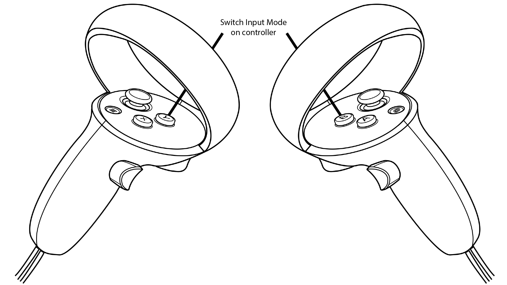

## General
There are three sets of controls in ECellDive which can be used in either the left or the right controller.
You can switch between a control set to another by pressing the *Y Button* on the left controller and the *B Button* on the right controller. By pressing the aforementioned buttons, the the controls will circle through *Groups Controls*-->*Movement Controls*-->*Ray-based Interaction Controls* on the corresponding controller.

When a user is dropped in the root Dive Scene, the left controller will use the *Ray-based Interaction Controls* and the right controller will use the *Movement Controls*. 
For each control set, the effect of the buttons are clearly visible in-app thanks to little tags attached to the 3D models of the controllers (see bellow). 
