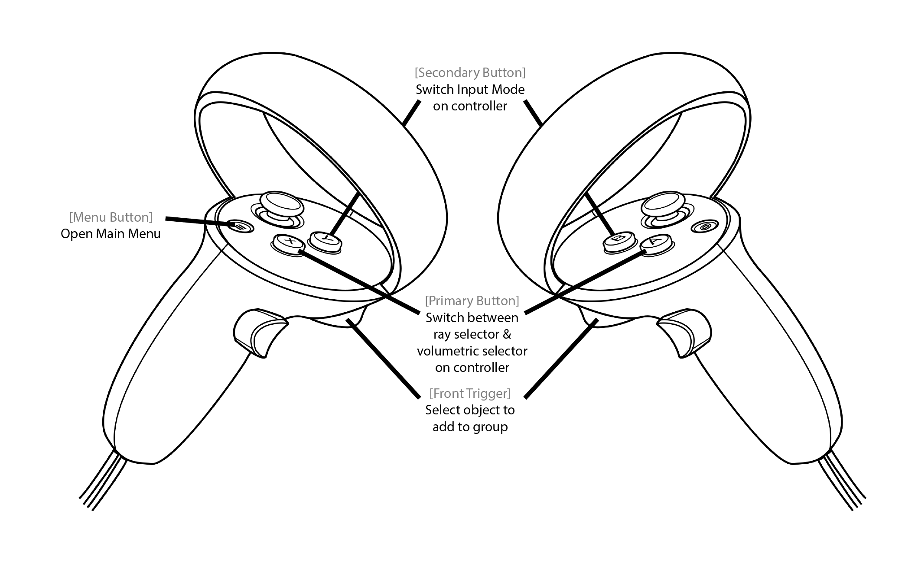
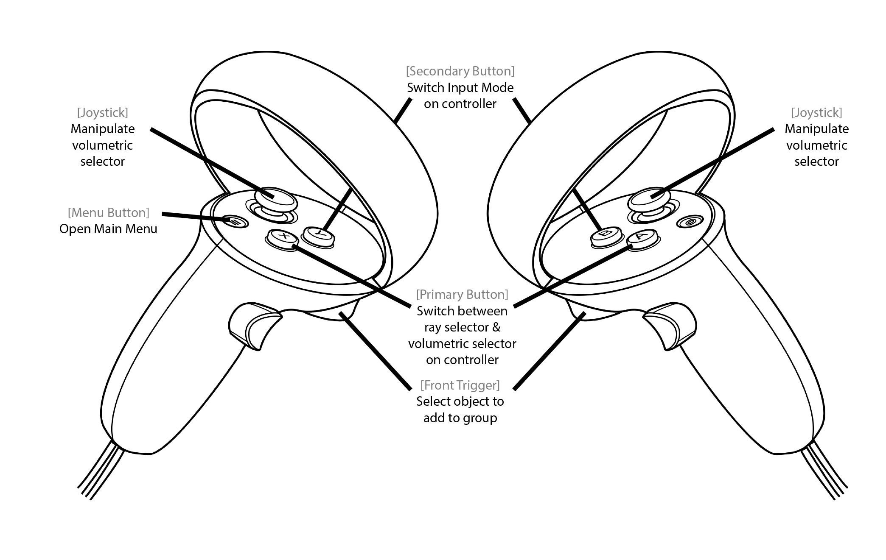

## Groups
This is a set of controls to define custom groups of elements in the Dive Scenes which will be recognizable by color and accessible in the [Groups Menu](/articles/UserManual/UIMenus/groups_menu.html). There are two alternative selectors to build custom groups which can be switched by pressing either the *Primary Button* of the respective controller.

### Ray selector
Adds elements one-by-one to the group being built. Point at the element with the ray and press the *Front Trigger*. The element is added to the group if it is not already in the group. Otherwise, the element is removed.

  

### Volumetric Selector
Uses a sphere as the selector. Any elements that collides with the sphere while the *Front Trigger* is pressed are added from the group if they are not already in it. Otherwise, the element is removed. Scale and position of the sphere can be controlled using the *Joystick*.

**KNOWN LIMITATION: It is not possible to modify the content of a group (remove od add elements) once it has been validated; you can only remove the whole group from the group menu.**