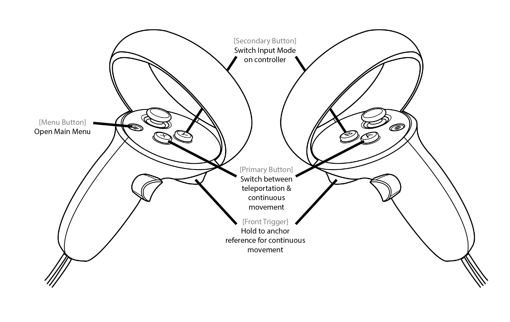

## Movement
This allows the user to move around in the Dive Scenes.
There are two alternative movement modes:
### Teleportation
Represented by a green ray and a green sphere at the end of the ray. The position of the sphere indicates the teleportation target. The user can teleport by pressing the *Front Trigger*. The teleportation distance can be changed using the *Joystick*.

### Continous movements.
**Use moderately for beginners as it is a source of motion sickness.** Upon pressing the *Front Trigger*, the user can move in the direction he translates his controller to. The direction and magnitude of the movement is composed from the individual vectors on the X, Y and Z axis represented by the red, green and blue line respectively.

