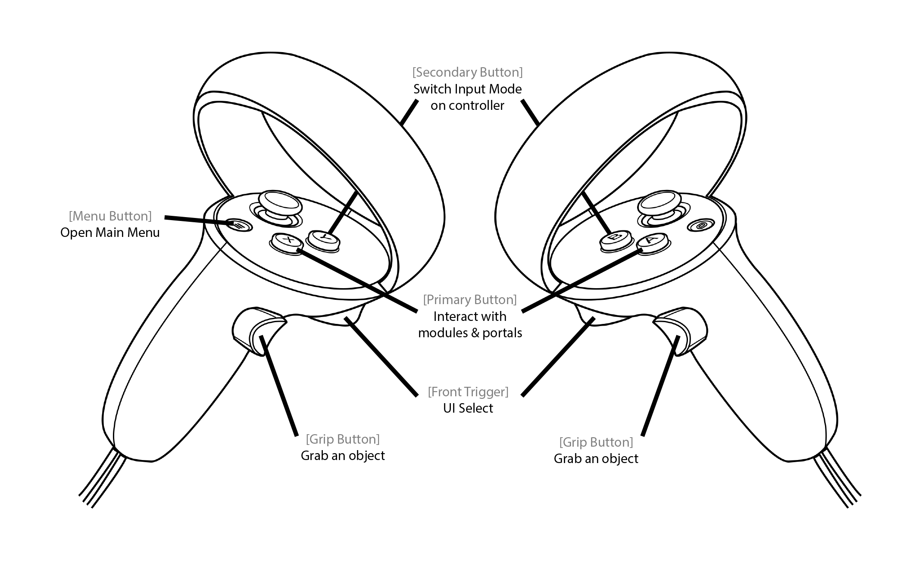
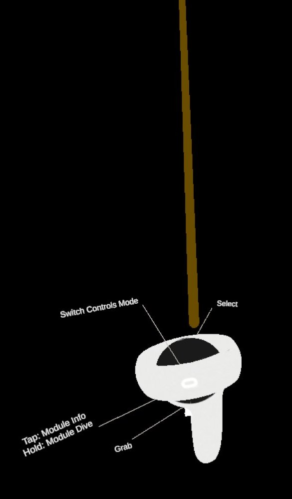

## Ray-based Interaction
This is the main control set built to interact with UI, grab & move objects, display the modules' parameters, knockout reactions, etc... Point at an element with the ray and press different buttons for different action on those elements.

  

### Grab elements
For a UI panel, point at the position handle (white horizontal bar) and hold the *Grip Button* of the corresponding controller. Once the UI panel is grabed, its central position will be updated as the controller holding it is moving.

### UI press
Point at a user interface component such as a button and press the *Front Trigger*.
The interaction ray turns blue (as in the image bellow) when you can perform a UI interaction (press a button in this case)

### Open a module's parameters panel
Point at a module and press the *Primary Button* of the corresponding controller.

### Dive into a portal
Point at it and hold the *Primary Button* of the corresponding controller. Diving take one second to activate; the controller will vibrate during that time. Once the vibration is finished, the dive process has started. **It will take a few seconds depending on the size of the data to Dive into**.

