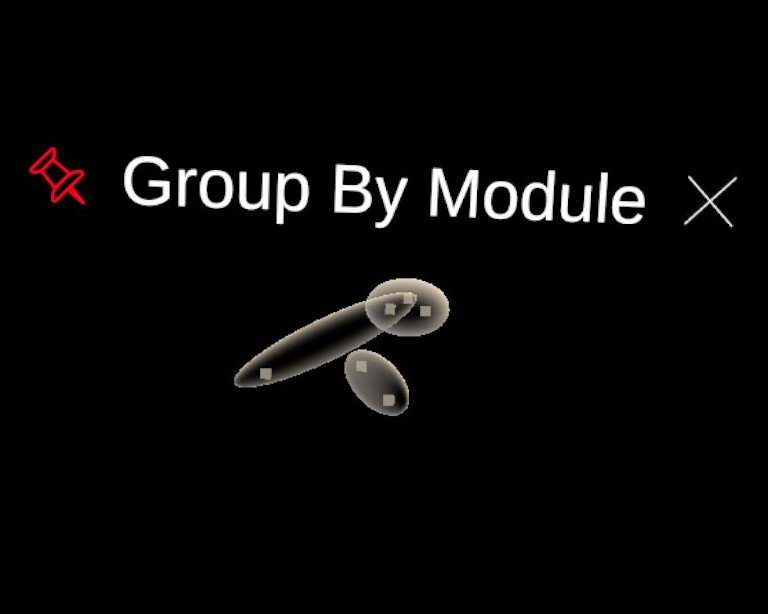

## GroupBy

This is the module used to automatically make coloured groups according to metadata of the elements loaded in the scene. 

### Panel *Grouping Attributes*:
1. Scroll List. If the module detected elements it can try to group according to their metadata, then the names of the elements will be displayed in this list. For example, if a user loaded a CyJson pathway then the *nodes* and *edges* will appear.
2. Button in the Scroll List. Upon clicking on the button corresponding to an element that can undergo automatic grouping, a new scroll list will be displayed showing the metadata that can used to make the groups. If several metadata are selected then every group types will be generated individually and accessible through the *Groups UI Menu*. No set operation (such as INTERSECTION or UNION) are performed on the groups. 
3. Button *Process Grouping*. Make groups according to every metadata selected for every elements detected. Usually very fast but the time actually depends on the number of groups to generate and the number of elements loaded in the dive scene.