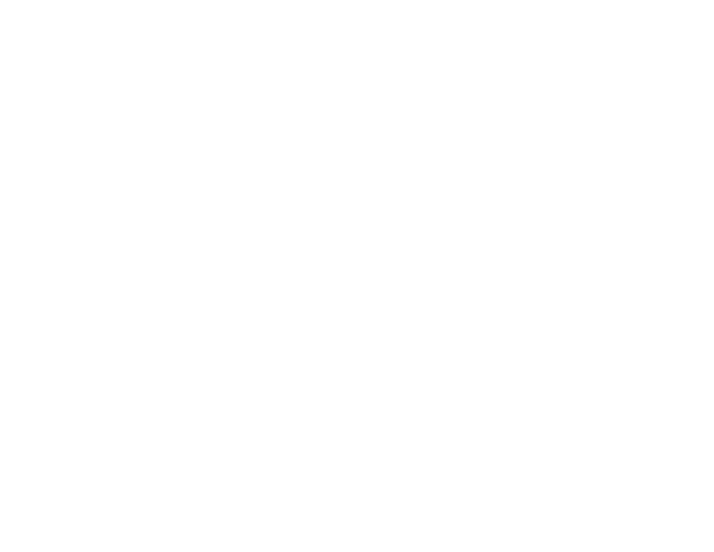

 

# Context
ECellDive is a VR application for systems biology. It is part of a research project exploring how biologists will be working tomorrow in the context of metaverses. Our first target is to provide an integrated workspace for visualization, simulation and modelling of biological systems in real-time between colleagues. In the meantime, it will be the space of experimentations regarding exploration of data in a virtual reality environment. As such, this project is under active development and subject to a lot of changes: features may come and go depending on their actual usefullness.

# Documentation
Documentation about ECellDive's in-app features is accessible [here](https://ecell.github.io/ECell_Dive/). **Documentation about the source code will also be published soon.**

# Quick start-up with iJO1366
## Installation
ECellDive runs on the Meta Quest 2. The .apk file can be downloaded from the release page and installed on any Quest 2 heasdset thanks to [SideQuest](https://sidequestvr.com/).

## Have answer_talker running
To work properly, ECellDive needs [answer_talker](https://github.com/ecell/answer_talker). It is a server to which the user can connect in ECellDive to import data, request calculations and save modification files. To properly communicate, the computer running *answer_talker* and the Meta Quest 2 headset **must be on the same local network**; preferably the same router but a VPN might also work. When both are runing (see [answer_talker](https://github.com/ecell/answer_talker) page for details on how to launch the server), you can access the server from ECellDive with different modules in-app

## Importing iJO1366
Open the main menu and navigate to the module menu. Add a [remote importer module](/docs/UserManual/Modules/remote_importer_module.md) to the dive scene. Enter the IP address where your instance of answer_talker is hosted and request the list of available modules. You should have access to iJO1366 by default: click on the corresponding button to import the data.

## Diving in iJO1366
Once iJO1366 is in the scene, point at the 3D model of the module with the [Ray-based Interaction Controls](/docs/UserManual/Controls/ray_based_interaction_controls.md) and hold the main button of the controller you are using for 1 second to dive into it (either *A Button* or *X Button*). **This takes about 10 seconds. For now, there is no visual, sound or haptic feedback to tell you that you are currently diving. But there is actually a noticeable framerate drop because the process is too intense for the Meta Quest 2 hardware. This is obviously not the intended behaviour and we are still figuring out how to make this step smoother.**

## Visualizing the main parts of the pathway.
Once you can see the pathway, you are free to [move around](/docs/UserManual/Controls/movement_controls.md) the dive scene to explore and familiarize yourself with its structure. Navigate to the Module menu and add a [GroupBy module](/docs/UserManual/Modules/groupby_module.md) to the dive scene. Click on *edges* and select *Subsystem* to group edges according to the main parts of the pathway (membrane transport, glycolysis, citric acid cycle, etc...).

## Requesting a flux balance analysis.
Get back to the module menu and add a [FBA module](/docs/UserManual/Modules/fba_module.md). Input the IP address where your instance of *answer_talker* is hosted and request the FBA to run. This takes 2-3 seconds.
Running the FBA will reset the color of the edges. You can visualize back the groups you defined by navigating to the [groups menu](/docs/UserManual/UIMenus/groups_menu.md) and checking/unchecking the checkbox associated with the group you are interrested in.
You can knockout reactions if you wish by pointing at them with the [Ray-based Interaction Controls](/docs/UserManual/Controls/ray_based_interaction_controls.md) and pressing the *Front Trigger*. A knocked out reaction will appear as a solide edge instead of dashed. After knocking out the reactions you are interrested in, you can re-run the FBA.

## Saving the mofications.
You can save the current state of iJO1366 (knocked out reactions) thanks to the [Modifications Handler Module](/docs/UserManual/Modules/modification_handler_module.md). In the *Server Parameters* panel, input the IP address where your instance of *answer_talker* is hosted. Then, select the base model for which you wish to save the modifications (in this case it should be iJO1366). Chose a name for the file if you wish to (by default it will be *NameOfBaseModel_yyyyMMddTHHmmssZ*). After hitting the *Save Button*, you can confirm whether the file was correctly saved by taking a look at the last Trace message in the [Log menu](/docs/UserManual/UIMenus/log_menu.md) or by clicking the *Query Available Modification Files Button*. In the latter case, the new file should appear in the *Modification Files* panel.

# Related resources
## Papers
In progress

## Videos

- *ECellDive alpha-0.8.3 | WIP*. March 2022. Supplementary Material of a poster presented at RIKEN BDR Symposium on the theme ["Emergence in Biological Systems: Challenges to Bridging Hierarchies"](https://www2.bdr.riken.jp/sympo/2022/)

